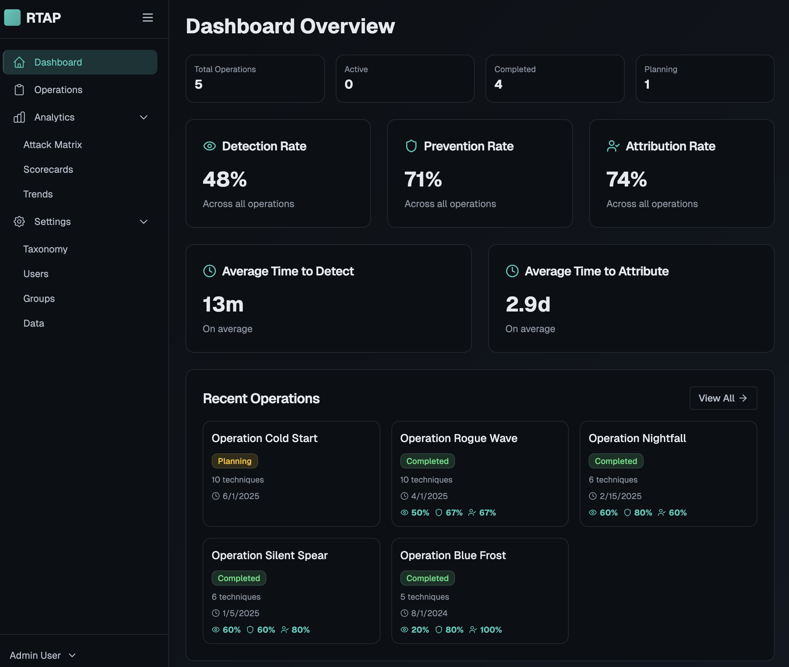

# Red Team Assessment Platform (RTAP)

_This is an experiment in creating something useful with AI coding agents. The initial version was made with Claude Code, but it has since been largely re-written by GPT-5 Codex. It is a personal hobby project, with no commitments and no promises._

The Red Team Assessment Platform (RTAP) is built for internal Red Teams to plan and analyze their operations. The features and functionality are designed with their specific needs in mind, such as:

- Integrating the concept of threat actors and crown jewels into all operations - who is being emulated, what is being targeted, and how is that trending over time?
- Producing visually appealing artifacts from individual operations, such as attack heatmaps and interactive flow charts that allow the operator to design meaningful attack narratives.
- Tracking defensive outcomes in the context of full-scale Red Team operations - not just detection and prevention but also attribution, including log sources and timing.
- Deep integration into MITRE ATT&CK and STIX 2.1 standards - including importing attack campaigns and threat actor profiles directly from MITRE or from other STIX-based threat intelligence sources.
- RBAC with group restrictions, allowing teams to work on operation planning in stealth before providing visibility to other platform users.

## Docs

User Docs:
- [Installation](docs/installation.md)
- [Getting Started Workflow](docs/getting-started.md)

Development Docs:
- [UI Style Guide](docs/dev/STYLE.md)
- [Design Overview](docs/dev/DESIGN.md)

## Contributing

This is still an early experiment, and I'm not ready for big contributions. If you have an idea, please open an issue first. I'd like to play around with it a bit more before deciding if it's useful and what shape it should take.

See [AGENTS.md](AGENTS.md) for engineering standards.

## Security

If you see something scary, please open an issue to let me know.

## Tech Stack

Initially based on the T3 Stack - Next.js, tRPC, Prisma, TypeScript. Type-safe APIs, server-side rendering, and component-driven design.

Local development uses sqlite and the node server. "Production" installation uses docker-compose, postgres, and BYO-reverse-proxy.

Authentication is all passwordless using NextAuth - with an option for passkeys and/or OAuth providers (initial support includes Google SSO).

## Licensing

The MITRE ATT&CK data included in this project is pulled directly from [their CTI project](https://github.com/mitre/cti), which requests the following statement be included:

> "© 2025 The MITRE Corporation. This work is reproduced and distributed with the permission of The MITRE Corporation."
